# Predictive Maintenance — Class Imbalance Handling & SHAP-Based Interpretability

Investigating how class-imbalance handling strategies (No Handling, Class Weighting, SMOTE) affect both **predictive performance** and **SHAP-based interpretability** for machine-failure prediction, using Random Forest, SVM, and XGBoost classifiers on the AI4I 2020 Predictive Maintenance dataset.

A full write-up of the methodology, results, and discussion is available in [`paper/paper.pdf`](Paper/paper.pdf).

---

## Table of Contents

- [Overview](#overview)
- [Project Structure](#project-structure)
- [Dataset](#dataset)
- [Exploratory Data Analysis](#exploratory-data-analysis)
- [Methodology](#methodology)
- [Results](#results)
- [SHAP Interpretability](#shap-interpretability)
- [Interactive App](#interactive-app)
- [Key Findings](#key-findings)
- [Limitations](#limitations)
- [Citation](#citation)

---

## Overview

Industrial predictive maintenance (PdM) systems rely on machine learning to flag equipment failures before they happen. Failures, however, are rare events — in this dataset, only **3.39%** of observations are failures — which makes class imbalance a central obstacle for both performance and trust in the model.

This project asks two questions:

1. **Performance:** How do Random Forest, SVM, and XGBoost respond to No Handling, Class Weighting, and SMOTE across nine configurations?
2. **Interpretability:** Does the choice of imbalance strategy change *what the model says drives its predictions*, using SHAP (SHapley Additive exPlanations)?

---

## Project Structure

```
.
├── app.py                          # Streamlit app for live predictions + SHAP explanations
├── predictive_maintainance.ipynb   # Full analysis: preprocessing, training, evaluation, SHAP
├── requirements.txt                # Python dependencies
├── artifacts/                      # Saved models / pipeline objects
├── data/                           # Dataset files
├── images/                         # Plots referenced in this README
└── paper/
    ├── paper.tex                   # LaTeX source (IEEEtran conference format)
    ├── paper.pdf                   # Compiled paper
    └── plots/                      # Figures used inside the paper
```

---

## Dataset

The [AI4I 2020 Predictive Maintenance Dataset](https://archive.ics.uci.edu/dataset/601/ai4i+2020+predictive+maintenance+dataset) is a synthetic industrial dataset with 10,000 observations and 6 operational features (product type, air temperature, process temperature, rotational speed, torque, and tool wear).

**Class distribution — 9,661 "No Failure" vs. 339 "Failure" (≈28.5:1 imbalance):**

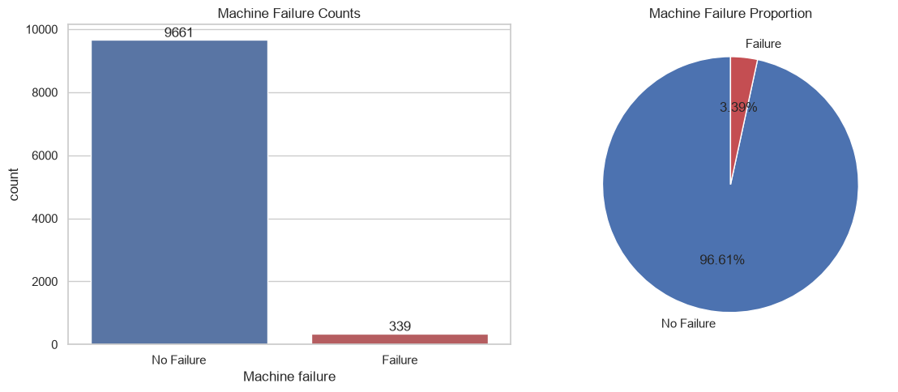

---

## Exploratory Data Analysis

**Feature distributions:**

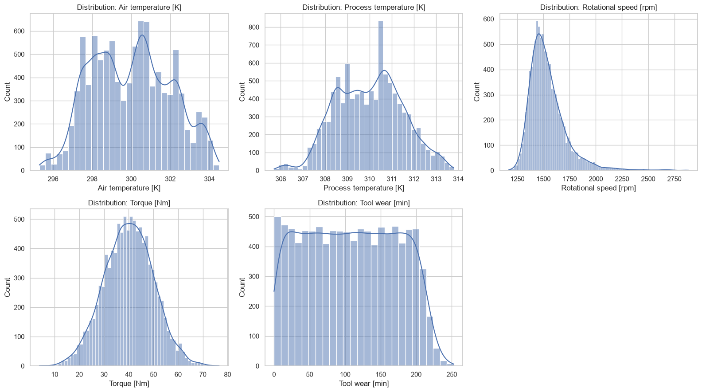

**Feature spread by failure status:**

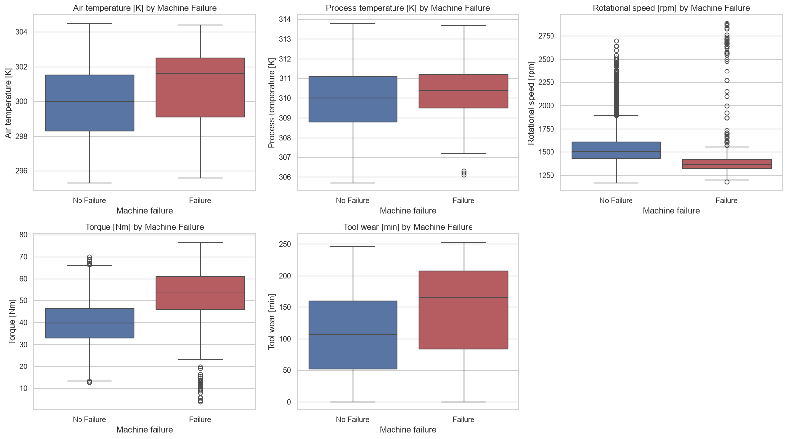

**Correlation matrix:**

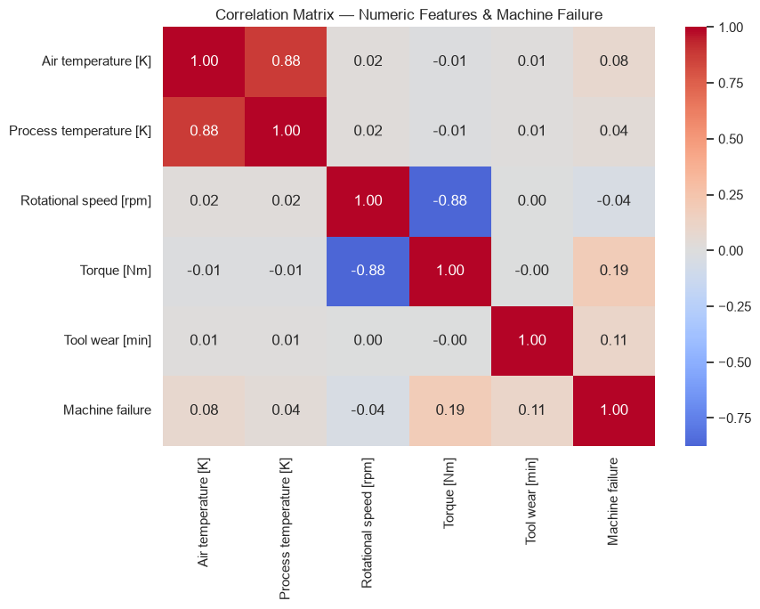

**Product type vs. failure rate:**

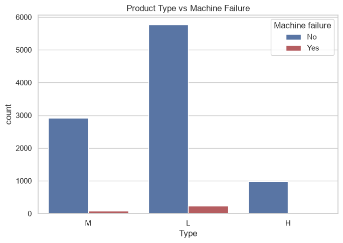

---

## Methodology

- **Split:** 80/20 stratified train-test split; the test set is never touched by resampling.
- **Preprocessing:** One-hot encoding for `Type`, `StandardScaler` for numeric features, plus two engineered features (temperature difference, mechanical power).
- **Imbalance strategies:** No Handling, Class Weighting (balanced weights / `scale_pos_weight`), and SMOTE (applied only to training data, inside an imbalanced-learn pipeline).
- **Models:** Random Forest, RBF-SVM, XGBoost — evaluated across all 3 imbalance strategies (9 configurations total).
- **Metrics:** Accuracy, Precision, Recall, F1, ROC-AUC, and **PR-AUC** (primary metric, given the rare positive class).
- **Interpretability:** SHAP applied to the selected XGBoost model to compare global/local feature attributions between Class Weighting and SMOTE.

---

## Results

### Model Performance Across Imbalance Strategies

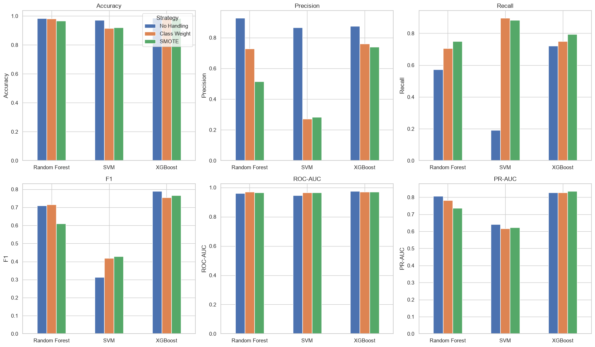

**XGBoost + SMOTE** achieved the best PR-AUC (0.836) and recall (0.794), while **XGBoost + No Handling** retained higher precision (0.875) — illustrating the classic precision/recall trade-off that comes with improving minority-class detection.

### Confusion Matrices

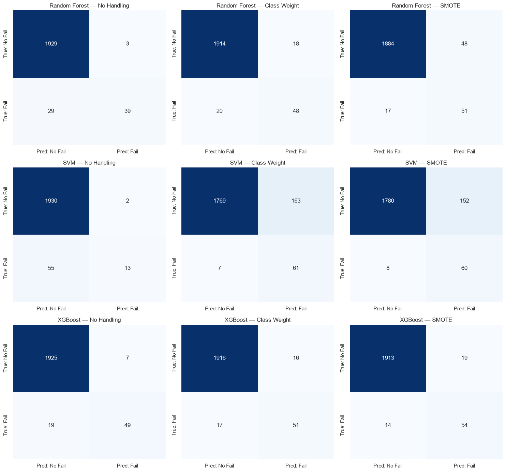

### Error Analysis — Missed Failures

For the selected XGBoost + SMOTE model, 14 of 68 actual failures were missed (false negatives). Breaking these down by failure mode shows **Tool Wear Failure (TWF)** dominates the missed cases:

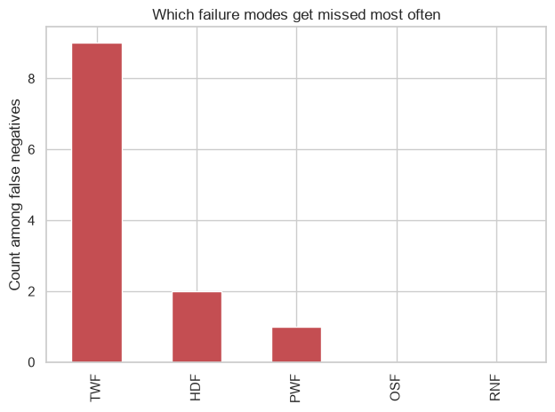

---

## SHAP Interpretability

### Global Feature Importance

**Bar plot (mean |SHAP value|):**

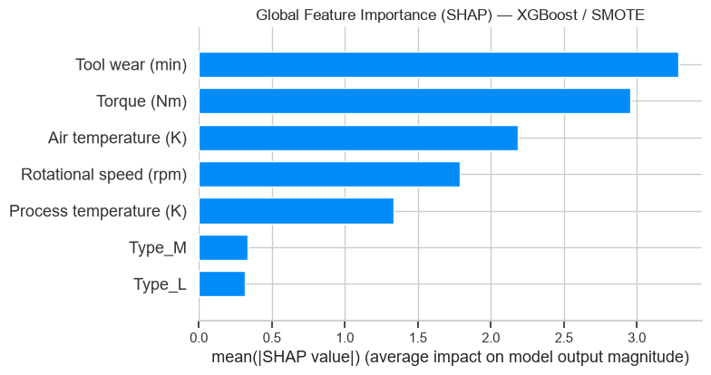

**Beeswarm plot (direction + magnitude of impact):**

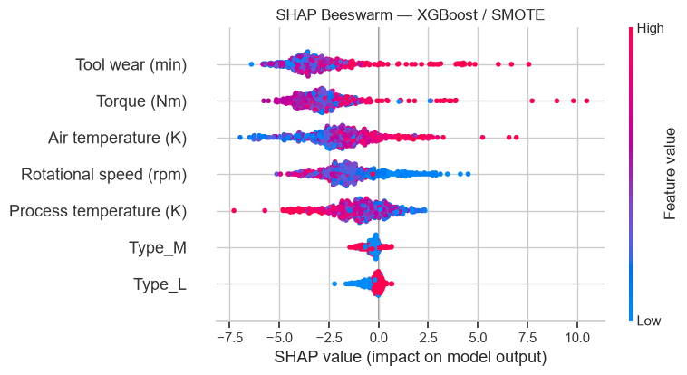

**Torque** and **Tool wear** are consistently the two strongest drivers of failure predictions, followed by temperature-related and rotational-speed features.

### Local Explanations

**A correctly detected failure (true positive)** — high air temperature and rotational speed push the prediction strongly toward failure:

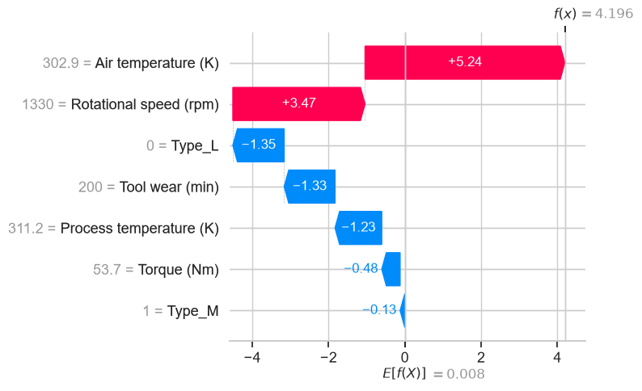

**A missed failure (false negative)** — high tool wear pushes toward failure, but several other features pull the prediction back toward "no failure," producing a borderline, ultimately incorrect call:

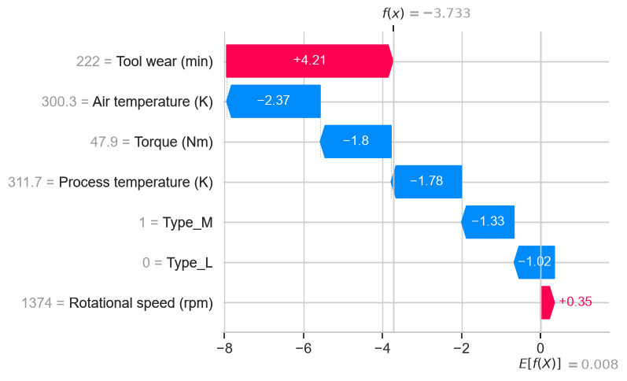

### Class Weight vs. SMOTE — Does Imbalance Handling Change Explanations?

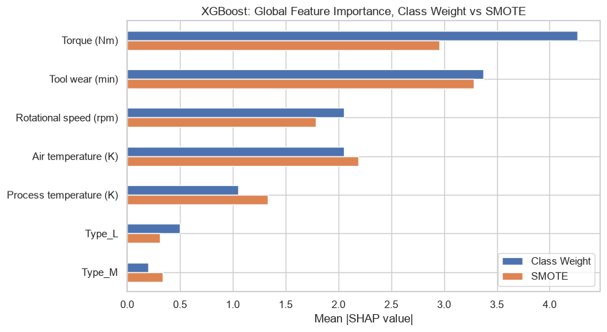

Both configurations agree on the top two features (Torque, Tool wear), but the relative ranking of secondary features shifts (e.g., Rotational speed vs. Air temperature swap places). The feature-importance vectors correlate at **0.949** — strong agreement, but not identical. This suggests imbalance handling should be treated as a factor that can subtly reshape a model's explanatory narrative, not just its accuracy numbers.

---

## Interactive App

A Streamlit app (`app.py`) wraps the final **XGBoost + SMOTE** model for live, interactive failure prediction.

**Prediction page** — enter live operating readings and get an instant failure probability:

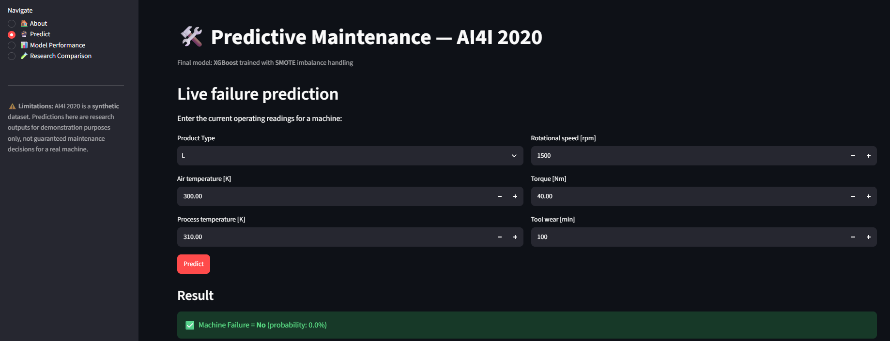

**Explanation page** — see the SHAP-based justification behind each prediction:

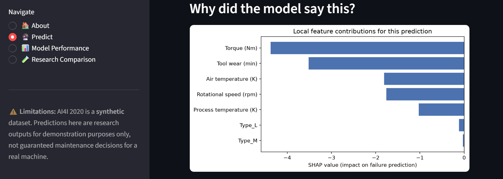

> ⚠️ **Limitation banner (as shown in the app):** AI4I 2020 is a synthetic dataset. Predictions here are research outputs for demonstration purposes only, not guaranteed maintenance decisions for a real machine.

---

## Key Findings

- **XGBoost is the strongest model family** for this task, retaining a good balance of precision and recall across all three imbalance strategies.
- **No single imbalance strategy is universally best** — SVM was highly sensitive to both class weighting and SMOTE (large recall gains, large precision losses), while Random Forest showed a milder version of the same trade-off.
- **Improving recall has a cost** — every strategy that boosted recall did so partly at the expense of precision (more false alarms).
- **Imbalance handling affects explanations, not just scores** — Class Weighting and SMOTE produce highly correlated (0.949) but non-identical SHAP feature-importance rankings for the same XGBoost model, meaning the choice of strategy can shift which secondary features look most influential.
- **Torque and Tool wear are the dominant, stable drivers** of failure predictions across both explainability treatments.

## Limitations

- AI4I 2020 is a **synthetic** dataset; results should be treated as a benchmark, not direct evidence for a real production line.
- Experiments use a single fixed train-test split rather than repeated cross-validation.
- Only three model families were evaluated.
- SHAP values explain model behavior — they are not evidence of physical causality.

Full discussion of limitations and future work is in [`paper/paper.pdf`](paper/paper.pdf).

---

## Citation

If you use this work, please cite:

```
S. Yousaf Shah, "Investigating the Impact of Class Imbalance Handling on Machine
Learning Performance and SHAP-Based Interpretability for Predictive Maintenance."
```

**Contact:** syedyousafshah997@gmail.com
